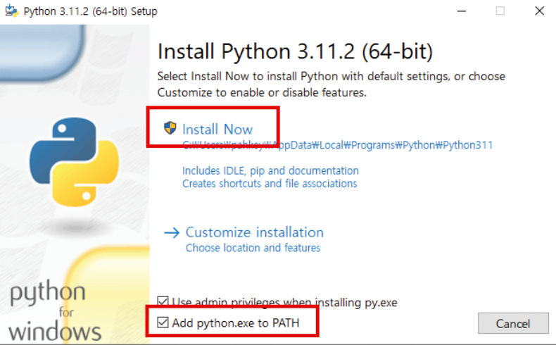
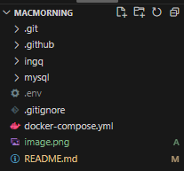

# MACMORNING - BE

## IngQ Project

### 개발 환경 구축
#### 사전 준비
1. Python 3.11.0 버전 다운로드
    - https://www.python.org/downloads/release/python-3110/
    
    - 설치 시 아래 환경변수 추가를 선택해주세요(위 링크 사용 시 이미지 버전은 3.11.0으로 뜰거에요)
    

2. uv 프로젝트 관리 툴 다운로드
    - 설치 방법 2가지(pip install VS 전역 설치)
        1. ~~`pip install uv` Python 프로젝트 내에서만 사용~~
        
        2. MacOS(전역 설치)
            ```
            brew install uv
            ```

        3. Window(전역 설치)

            ```
            powershell -ExecutionPolicy ByPass -c "irm https://astral.sh/uv/install.ps1 | iex"
            ```


    - __2번 또는 3번 전역 설치 진행__

        - uv 설치 후 `uv --version` 명령어로 확인 
        - 실행 안 될 경우 환경 변수 확인

3. Docker 설치

4. Docker로 MySQL 컨테이너 실행   
    
    Terminal에서 실행
    ```
    docker run --name ingq-mysql -p <포트번호>:<포트번호> -e MYSQL_ROOT_PASSWORD=<비밀번호> -d mysql:8
    ```    

    포트번호 및 비밀번호 <> 없이 작성, 환경 변수에 설정된 번호 작성

5. MySQL 컨테이너 접속

    Terminal에서 실행(아래 명령어 실행 시 bash shell로 이동)
    ```
    docker exec -it ingq-mysql bash
    ```

6. MySQL 접속

    bash Shell에서 실행
    ```
    mysql -u root -p
    ```
    위 명령어 실행 후 비밀번호 입력

7. 데이터베이스 생성

    mysql에서 실행
    ```
    CREATE DATABASE macmorning default CHARACTER SET UTF8;
    ```
</br>

#### 가상환경 구축 및 BE 프로젝트 실행
1. git clone을 통해 해당 repository 내용 로컬로 복사

    ```
    git clone https://github.com/JNU-econovation/MacMorning-BE.git macmorning_be
    ```

2. 해당 디렉터리로 이동

    ```
    cd macmorning_be/ingq
    ```

3. 의존성 설치 및 가상 환경 구성

    ```
    uv sync
    ```

4. .env 파일 추가

    
    
    __ingq 디렉터리 XXX, .env 파일 위치 주의!!!__


5. 프로젝트 실행 & 확인

    ```
    uv run main.py
    ```
</br>

#### 가상환경 구축 및 AI 프로젝트 실행
    
- BE 서버 구축 시 clone 했다면 1번 생략

1. git clone을 통해 해당 repository 내용 로컬로 복사

    ```
    git clone https://github.com/JNU-econovation/MacMorning-BE.git macmorning_be
    ```

2. 해당 디렉터리로 이동

    ```
    cd macmorning_be/ai
    ```

3. 의존성 설치 및 가상 환경 구성

    ```
    uv sync
    ```

4. 프로젝트 실행 & 확인

    ```
    uv run main.py
    ```

5. AI 서버 포트 주의!

    ```
    be 서버와 ai 서버의 포트가 다르므로 .env 확인 필요
    ```


</br>


<br/>

### FE 로컬 환경으로 테스트시 활용법(docker-compose 사용)
__개발환경 구축할 때는 docker-compose 사용 금지__

1. Docker와 docker-compose 설치

2. git clone을 통해 해당 repository 내용 로컬로 복사

    ```
    git clone https://github.com/JNU-econovation/MacMorning-BE.git macmorning_be
    ```

3. .env 파일 추가
    
    

    __ingq 디렉터리 XXX, .env 파일 위치 주의!!!__

    5번(도커 컴포즈) 진행하면 mysql 디렉터리는 자동으로 생성됩니다.

    이미지에는 없지만 /ingq 위쪽에 /ai 디렉터리도 있습니다!

4. 해당 디렉터리로 이동

    ```
    cd macmorning_be
    ```

5. 도커 컴포즈 실행

    ```
    docker-compose up -d
    ```

6. 도커 컨테이너 실행 확인

    ```
    docker ps
    ```

    3개의 컨테이너가 모두 실행중이면 정상 동작

</br>

#### 종료하고 싶을 때
```
docker-compose down
```

#### BE 코드 변경후 build가 필요할 때
```
docker-compose build
```