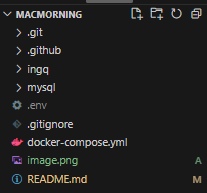

# MACMORNING - BE

# 🚀 IngQ Project (Backend)

IngQ는 생성형 AI를 활용하여 어린이를 위한 맞춤형 동화를 만들어주는 애플리케이션의 백엔드 저장소입니다. 아이들이 이야기에 직접 참여하며 상상력을 키우고, 어릴 때부터 즐거운 독서 습관을 기를 수 있도록 돕습니다.

## 📖 프로젝트 소개

IngQ는 아이들이 직접 동화의 주인공이 되는 특별한 경험을 제공합니다. 사용자가 동화의 시대적 배경, 주인공의 성격, 시점 등을 설정하면, 생성형 AI가 그에 맞는 흥미진진한 이야기와 선택지를 만들어냅니다. 사용자는 제시된 선택지를 고르거나 직접 원하는 행동을 입력하며 자신만의 이야기를 완성해 나갈 수 있습니다.

동화가 끝난 후에는 "왜 그런 선택을 했나요?" 와 같은 질문을 통해 아이가 자신의 선택을 되돌아보고 생각의 깊이를 더할 수 있는 회고 페이지를 제공하는 것이 IngQ 프로젝트의 핵심 목표입니다.

## ✨ 주요 기능

  * **맞춤형 동화 생성**: 시대, 주인공, 시점 등 사용자 설정에 기반한 AI 동화 생성
  * **인터랙티브 스토리텔링**: AI가 생성한 선택지 또는 사용자 직접 입력을 통한 이야기 전개
  * **AI 기반 삽화**: 이야기의 각 장면에 어울리는 삽화를 AI가 동적으로 생성
  * **사용자 인증**: 안전한 사용자 로그인 및 회원가입 처리
  * **동화책 저장 및 관리**: 사용자가 만든 동화책을 저장하고 언제든 다시 볼 수 있는 '나의 서재' 기능
  * **선택 회고**: 이야기가 끝난 후 자신의 선택에 대해 다시 생각해볼 수 있는 질문 페이지

## ⚙️ 기술 스택

  * **Backend & AI**: FastAPI
  * **Database**: MySQL
  * **RefreshToken Management**: Redis
  * **Containerization**: Docker, Docker Compose

## 🏗️ 아키텍처

IngQ 프로젝트는 Backend 서버와 AI 서버로 구성되어 있습니다.

  * **Backend 서버 (본 저장소)**: 사용자 인증(JWT), 동화책 정보 저장/조회 등 핵심 비즈니스 로직을 처리합니다. AI 서버와 통신 시 토큰 기반으로 인증을 거칩니다.
  * **AI 서버**: Backend 서버의 요청을 받아 생성형 AI 모델을 통해 이야기, 선택지, 삽화를 생성하고 결과를 반환합니다.

<!-- end list -->

1.  생성 API 요청
2.  BE로 AccessToken 검증 요청
3.  (2번 검증 완료된 경우)AI 추론 요청
4.  최종 결과 반환

## 🏁 시작하기

Docker와 Docker Compose가 설치되어 있어야 합니다.

#### **저장소 복제 (Clone)**

```bash
git clone https://github.com/JNU-econovation/MacMorning-BE.git
cd MacMorning-BE
```

#### **환경 변수 설정 (.env 파일 생성)**

프로젝트 루트 디렉토리에 `.env` 파일을 생성하고, 아래 내용을 참고하여 자신의 환경에 맞게 변수들을 설정해주세요.
(개발 환경(AWS와 같은 서버)에서 해당 프로젝트를 진행할 때 주의할 것)

  * EC2와 같은 서버 생성
  * S3 버킷 생성 및 CloudFront 생성
  * docker-compose-dev.yml에서 certbot만 실행시켜 SSL 인증서 미리 발급

<!-- end list -->

```
# ingq-be 서버
BE_PORT="포트 번호"

ENCRYPTION_KEY="비밀번호 암호화에 사용할 키"

# alembic ini 파일 설정
DATABASE_URL_ALEMBIC="alembic에서 사용할 mysql 주소"

# ingq-mysql 서버
MYSQL_PORT="mysql 포트번호"
MYSQL_ROOT_PASSWORD="mysql 루트 비밀번호"
MYSQL_USERNAME="mysql 사용자 이름"
MYSQL_PASSWORD="mysql 사용자 비밀번호"

MYSQL_HOST="mysql 컨테이너 이름"

MYSQL_DB_NAME=macmorning

MYSQL_DATA_PATH=./mysql/data

# ingq-ai 서버
AI_PORT="포트번호"

# ingq-nginx 서버
NGINX_PORT=80
NGINX_SECURE_PORT=443

NGINX_LOG_PATH=./nginx/logs
NGINX_CONF_PATH=./nginx/nginx.conf

# ingq-certbot
EMAIL="certbot에 등록할 이메일"
AI_DOMAIN="서브 도메인"
BE_DOMAIN="서브 도메인"

# 본 프로젝트에서는 ai.macmorning.com / api.macmorning.com 분리

# JWT Config
ACCESS_SECRET_KEY=accesssecret
REFRESH_SECRET_KEY=refreshsecret
ALGORITHM=HS256

# ACCESS_TOKEN_EXPIRE_MINUTES=30
ACCESS_TOKEN_EXPIRE_MINUTES=1440
REFRESH_TOKEN_EXPIRE_MINUTES=1440

# Redis
REDIS_HOST="호스트 이름"
REDIS_PORT="포트번호"
REDIS_DATABASE=0
REDIS_PASSWORD="비밀번호"

# OpenAPI Key 추가
OPENAI_API_KEY="Open AI API Key"

# AWS S3
AWS_ACCESS_KEY_ID="S3 키 id"
AWS_SECRET_ACCESS_KEY="Secret Access Key"
AWS_DEFAULT_REGION="Aws 지역"
AWS_S3_BUCKET_NAME="S3 버킷 이름"

# CloudFront DOMAIN
CLOUDFRONT_DOMAIN="CloudFront 주소"

# AI 추가 env
BE_BASE_URL = "BE 주소"
CHROMA_HOST=localhost
CHROMA_PORT=8000
CHROMA_PERSIST_DIR=./chroma_db
```

#### **Docker Compose 실행**

아래 명령어를 통해 프로젝트의 모든 컨테이너를 실행합니다. (`-d` 옵션은 백그라운드 실행을 의미합니다.)

  * **로컬 환경**
    ```bash
    docker-compose -f docker-compose-local.yml up -d --build
    ```
  * **운영 환경**
    ```bash
    docker-compose -f docker-compose-dev.yml up -d --build
    ```

## 📜 API 문서 및 관련 링크

  * **자동 생성 API 문서**: 서버가 정상적으로 실행되면, 브라우저에서 `http://localhost:8000/docs` 로 접속하여 자동 생성된 FastAPI API 문서를 확인할 수 있습니다.
  * **API 명세서 (Notion)**: [전체 API 명세서 확인하기](https://woolly-water-e84.notion.site/api-1b9e1f841e7d80edbed2d1b5dbe7616b?source=copy_link)
  * **프론트엔드 GitHub 저장소**: [MacMorning-FE 바로가기](https://github.com/JNU-econovation/MacMorning-FE)


###### 해당 문서는 Gemini 2.5 Pro를 통해 작성되었습니다.

---
### 개발 환경 구축 상세

#### Local 개발 환경 구축 시 docker-compose 사용
1. Docker와 docker-compose 설치(각각 설치 필요)

2. git clone을 통해 해당 repository 내용 로컬로 복사

    ```
    git clone https://github.com/JNU-econovation/MacMorning-BE.git macmorning_be
    ```

3. .env 파일 추가
    
    

    __ingq 디렉터리 XXX, .env 파일 위치 주의!!!__

    5번(도커 컴포즈) 진행하면 mysql 디렉터리는 자동으로 생성됩니다.

    이미지에는 없지만 /ingq 위쪽에 /ai 디렉터리도 있습니다!

4. docker-compose 빌드

    ```
    docker-compose -f docker-compose-local.yml build
    ```

5. docker-compose 실행

    ```
    docker-compose -f docker-compose-local.yml up -d
    ```

6. 실행중인 컨테이너 확인

    ```
    docker ps
    ```

    3개의 서버가 실행중이면 정상 작동

7. 개발 진행
